# OS-Lab
Date Commands:
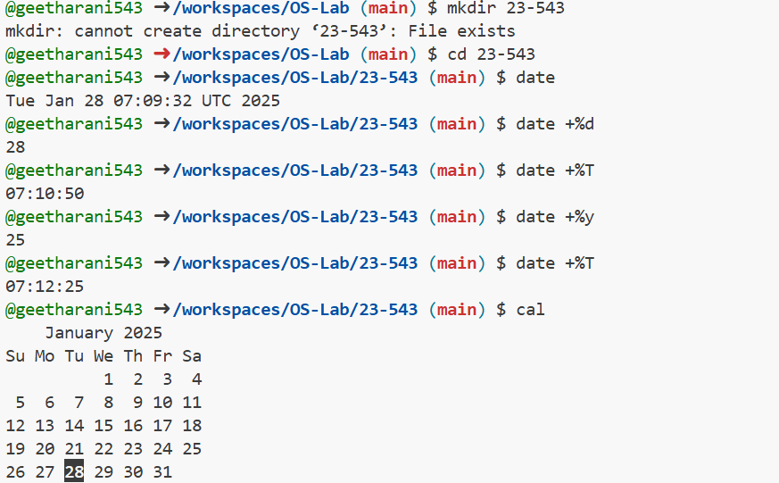
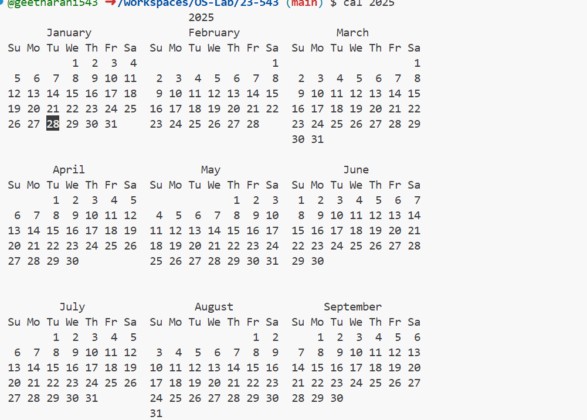
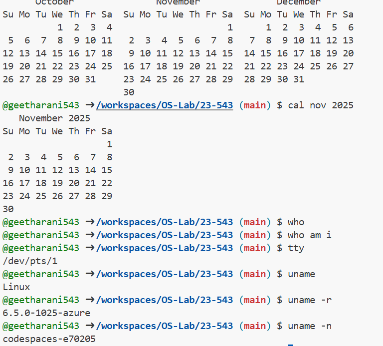
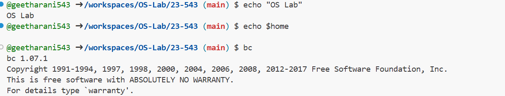
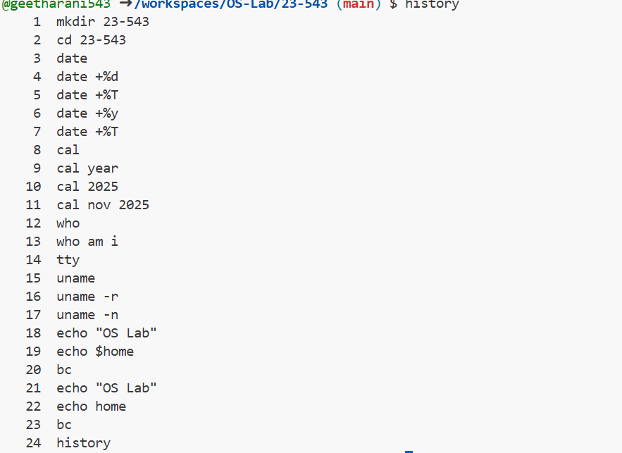
Directory commands:
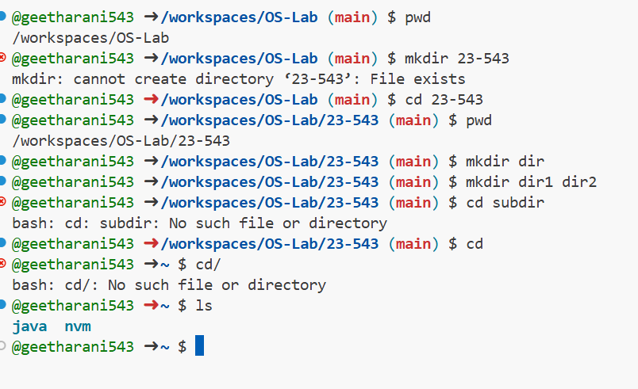
File Commands:
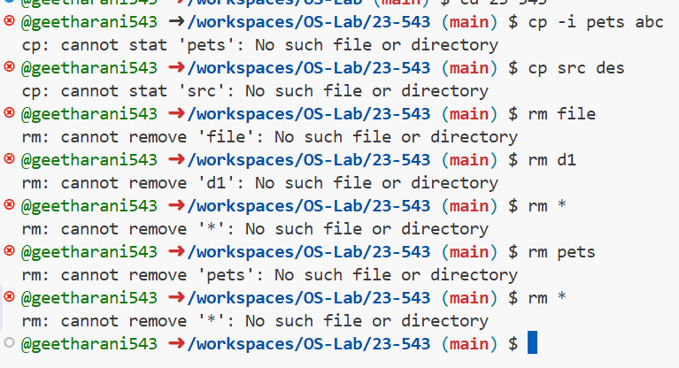
cp command:
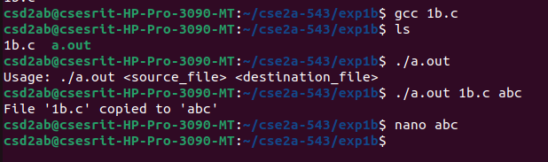
ls command:
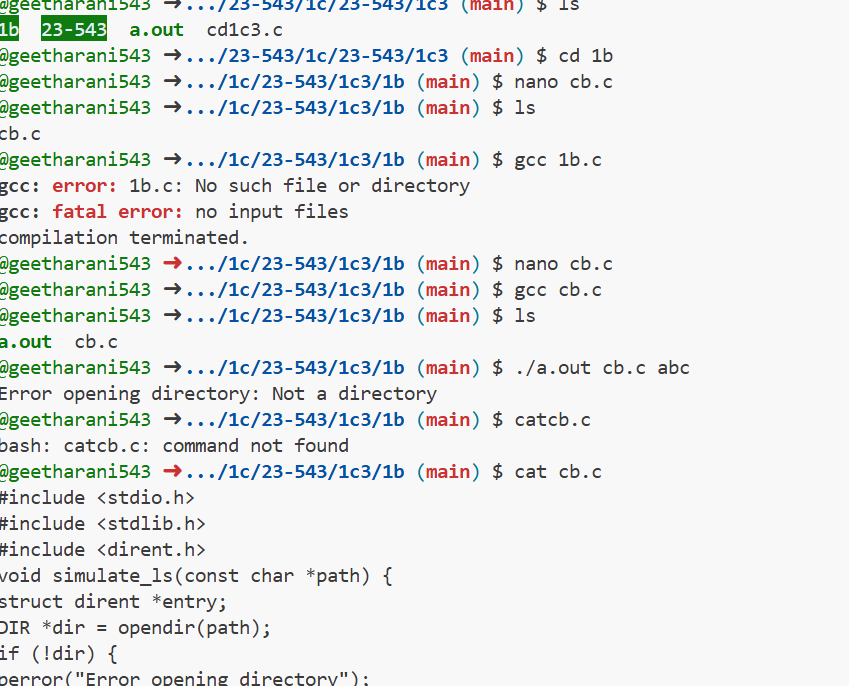
grep command:
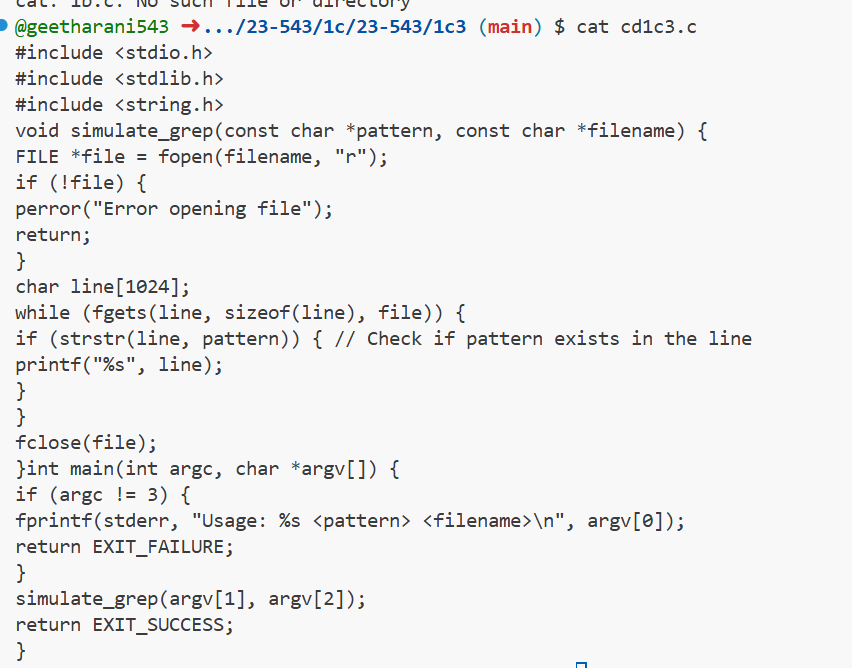
To implement UNIX operating system calls fork, exec, getpid,exit,wait,close,stat,opendir and readdir:
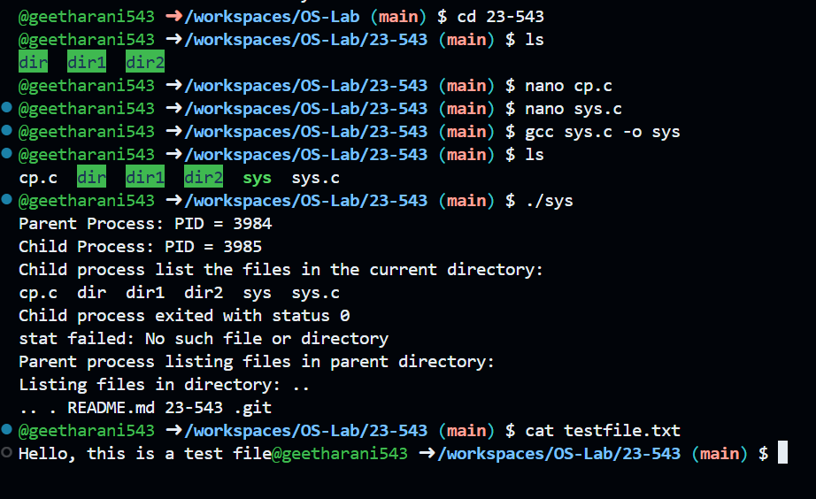
Experiment 4
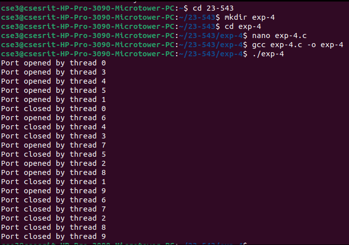
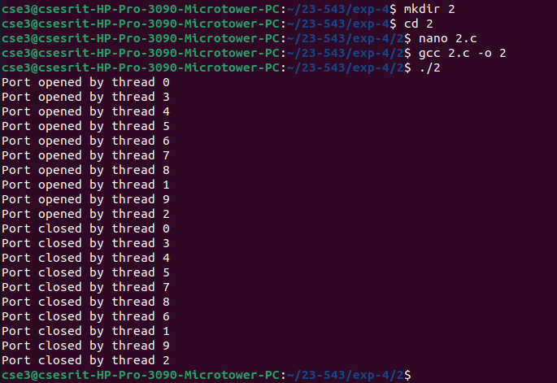

