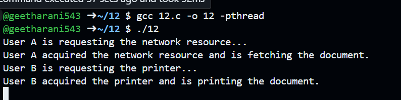

# OS-Lab
Date Commands:

Directory commands:

File Commands:

cp command:

ls command:

grep command:

To implement UNIX operating system calls fork, exec, getpid,exit,wait,close,stat,opendir and readdir:

Experiment 3

Experiment 4

Experiment 5

Experiment 6

Experiment 7

Experiment 8

Experiment 9

Experiment 10

Experiment 11

Experiment 12

